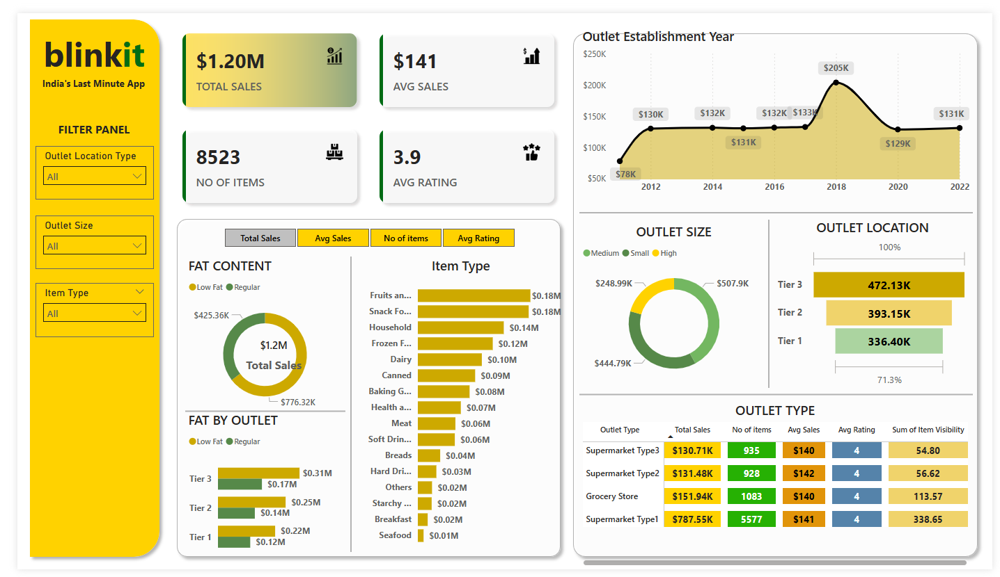

# BlinkIT Grocery Sales Dashboard Project

This project showcases a **Power BI Dashboard** built to analyze and visualize grocery sales data for BlinkIT, India's Last Minute App. The dashboard provides insights into sales performance, outlet types, item categories, and more.

---

## **Project Overview**

The **BlinkIT Grocery Sales Dashboard** is designed to help stakeholders understand key business metrics like total sales, average sales, number of items sold, and average ratings across different outlets. This project demonstrates my ability to perform data extraction, transformation, and visualization using Power BI.

---

## **Technical Details**

### **Tools and Technologies Used:**
- **Power BI**: Data visualization and dashboard creation
- **Excel**: Data source for sales and outlet data
- **DAX (Data Analysis Expressions)**: For creating calculated measures and columns
- **SQL (optional)**: For data cleaning and preprocessing (if integrated with databases)

### **Key Components:**
- **Data Modeling**: Relationships were established between tables to ensure accurate aggregations and filtering.
- **DAX Measures**:
  - Total Sales = SUM(Sales[Sales Amount])
  - Average Sales = AVERAGE(Sales[Sales Amount])
  - Number of Items = COUNT(Sales[Item ID])
  - Average Rating = AVERAGE(Sales[Rating])
- **Visualizations**:
  - **KPI Cards**: Highlight key metrics (Total Sales, Avg Sales, No. of Items, Avg Rating)
  - **Stacked Bar Chart**: Sales by Outlet Type and Item Fat Content
  - **Pie Chart**: Sales distribution by Outlet Size
  - **Line Chart**: Sales trend by Outlet Establishment Year
  - **Horizontal Bar Charts**: Sales by Item Type and Fat Content
  - **Table**: Outlet performance summary
- **Filters and Slicers**:
  - Outlet Location Type, Outlet Size, Item Type for dynamic filtering.

---

---

## **Insights from the Dashboard**

- **Supermarket Type1** generates the highest total sales ($787.55K), contributing significantly to overall revenue.
- **Low Fat items** contribute around 35% of total sales, while Regular Fat items dominate with 65%.
- **Tier 3 locations** have the highest sales performance ($472.13K), indicating strong demand in these areas.
- **Frozen Foods and Household items** are top-performing categories, contributing $0.12M and $0.14M respectively.
- **The sales trend over the years shows a peak in 2018 ($205K)**, possibly due to marketing campaigns or new store openings.
- **Outlet Size analysis reveals that Large outlets (High size) dominate sales ($507.9K)**, while small outlets contribute the least.

---

## **How to Run the Project**

1. Download the Power BI Dashboard file from this repository.
2. Open the file in Power BI Desktop.
3. Ensure the data source (Excel file) is placed in the correct path.
4. Refresh the data to see the latest visualizations.

---

## **Future Enhancements**
- Add more advanced DAX calculations for time-based analysis.
- Integrate with a live database for real-time updates.
- Implement advanced filtering using Power BI slicers.
- Add drill-through pages for more detailed insights.

---

## **Conclusion**
This project demonstrates my ability to analyze data, create insightful visualizations, and build user-friendly dashboards using Power BI. It highlights my proficiency in data analytics, business intelligence, and data storytelling.

> **GitHub Repository**: [[Link to Repository](https://github.com/PatelVaishvikk/BlinkIT-Grocery-Data-Analysis)] 

